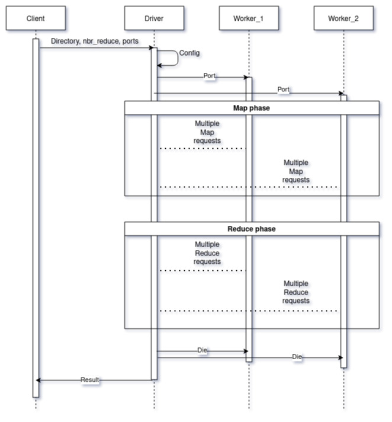

# **Conception**

The conception of this work is purely based on the document provided to me, which described a word-counter on map-reduce distributed system.

In this system we can declare three components:

- The worker(s): they are the building block of the system. they contain the code of the map/reduce operations.
- The driver: it can be described as the engine of the systems. It takes a request from the user that contains a folder to treat, the number of reduce operations and the works port. It automatically determines the number of workers, establish connections with them and inform them of its port. The driver also acts as a load balancer, in a sense where it dispatches the tasks on the workers based on a given policy.
- The client: its only role is to launch the driver and provide it with the needed parameters.

The following sequence diagram resumes the interactions between the components.



# **Policies**
The connectivity policy is simple. a component attempt to establish a connection and wait for 10 seconds, if the other side does not respond, the component raises an exception. This applies to all connections.

The load balancing policy is very straight forward. the driver has an array containing the states of all workers. If there exist at least one worker on idle state the driver picks the first free one. Otherwise(the case where all workers are occupied), the driver goes into hibernation state for a couple of seconds and then check if any worker has finished. This loop continues until at least one worker has been picked. This policy is applied during both map and reduce phases.

All the other policies and conditions are included in the provided document.

# **Implementation**

This work only uses only Python3 built-in libraries and gRPC.

we start by declaring the methods of our micro-services in the ```.proto``` files.

## Worker service
The worker.proto file contains the following methods:
```
    rpc setDriverPort(driverPort) returns (status);
    rpc map(mapInput) returns (status);
    rpc reduce (rid) returns (status);
    rpc die (empty) returns (status);
    rpc nothing(empty) returns (empty){}
```
- setDriverPort: set the driver port
- map: map operation
- reduce: reduce operation
- die: terminate process
- nothing: really nothing, just for testing :)

## Driver service
The driver.proto file contains the following methods:
```
    rpc launchDriver (launchData) returns (status);
    rpc nothing(empty) returns (empty){}
```
- launchDriver: launch the processing operation
- nothing: you already know what it does XD

## Now we can talk code!

---

We start by the trigger `client.py`.

In this file we import the libraries we need and the files generated by gRPC. Next, we establish a connection with the driver and call the `launchDriver` service to initiate the process. With our request we send the folder that contains the documents, the number of reduce operations, and the ports of the workers.

Next we move to the `worker.py`.

This class can be described as a typical python class. We import the files we define the class that extends `worker_grpc.WorkerServicer`. The most important methods here are `map` and `reduce`.

In the `map` method, we read the file sent to us, we perform a cleaning and tokenizing process. In this case since we are not interested in performing a lot of pre-processing, all we do is transform the document into lower case, we remove any character that is not an alphabet, and we split the document into words. Next, we go throw all the words and send each word into its corresponding bucket (the bucket id is equal to 'first_letter % M'). Finally, we save the buckets into files.

In the `reduce` method, we use the `glob` library to extract all the files that have `bucket_id` = `reduce_id`. Then, we use the `Counter` class in the `collections` to generate a frequency dictionary of the words. Finally, we save the generated file.

Finally the `driver.py`. The main method is `launchDriver`. this method starts by auto-configuration. It load the documents and save the ports of the workers. Then, it establishes connections with all the workers and rend a `setDriverPort` to all the workers. Next, the map phase. In this phase we take advantage of the `futures.ThreadPoolExecutor` to create multi-threading and call multiple workers "at the same time". The driver has an attribute that stores the state of each workers. The driver loops through the list of files and picks a worker to do it. In the case where all workers are occupied the driver sleeps for few seconds. Once a worker is selected, a `map` request is sent to the worker with required parameters. This phase is terminated when all the files are treated. Next, the `reduce` phase. This phase has exactly the same instructions to the `map` phase. After the end of the `reduce` phase, the driver send a `die` request to the worker (For our implementation, `die` does nothing, since the thread will terminate anyway, and using `sys.exit()` will produce a deadlock of the whole system). Finally, the driver returns a success status to the client.

---
The following video illustrates the system in work.
